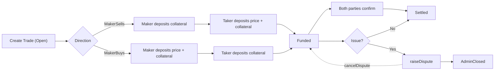
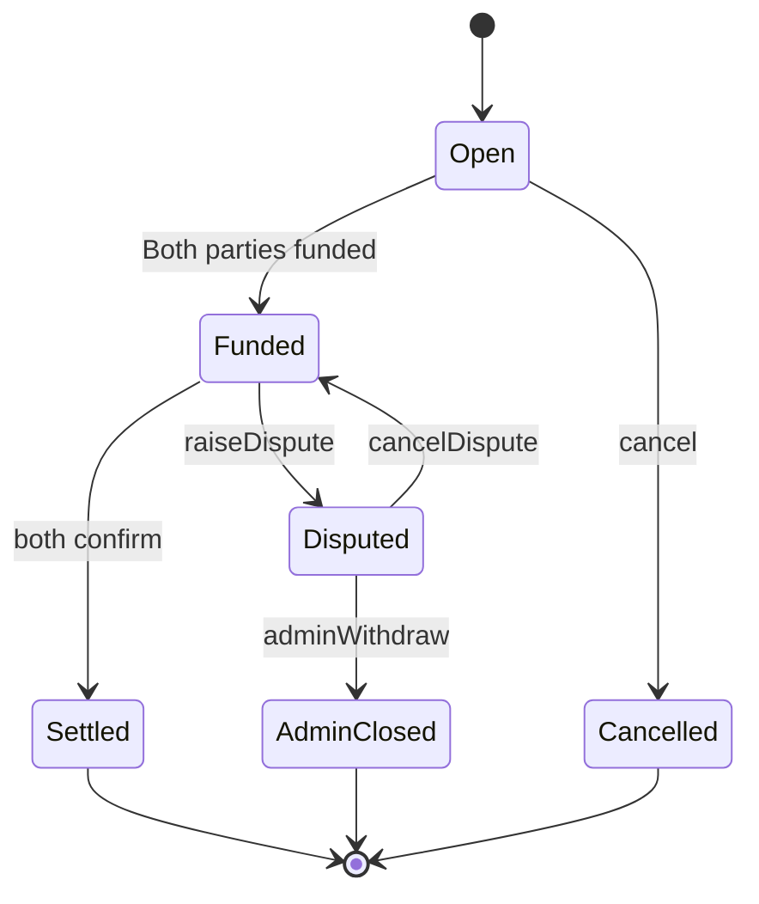

# OtcHub Smart Contract

OtcHub is a decentralized Over-The-Counter (OTC) escrow platform designed to ensure the security of both trading parties through a dual collateral mechanism.

## Features

  - **Bidirectional Trade Support**: Supports both MakerSells (seller-initiated) and MakerBuys (buyer-initiated) trade directions.
  - **Dual Collateral Mechanism**: Both buyer and seller are required to provide collateral, enhancing transaction security.
  - **Phased Transaction Process**: Open → Funded → Settled/Cancelled/Disputed.
  - **Dispute Resolution**: Supports raising disputes, canceling disputes, and administrator arbitration.
  - **Platform Fees**: Configurable platform transaction fees.
  - **Reentrancy Protection**: Built-in reentrancy attack prevention mechanism.
  - **Signed Orders (EIP-712)**: Off-chain signed orders with on-chain one-tx fills, including partial fills.
  - **Partial Fills**: Orders can be filled across multiple takers until exhausted.
  - **ERC20 Permit (optional)**: Gas-optimized allowance via permit during order fill.

## Contract Architecture

### Main Contracts

  - `contracts/contracts/OtcHub.sol`: The primary OTC trading contract.
  - `contracts/contracts/MockERC20.sol`: An ERC20 token contract used for testing.

### Trade States

  - `Open`: Trade created, awaiting funding.
  - `Funded`: Both parties have provided funds.
  - `Settled`: Trade completed and settled.
  - `Cancelled`: Trade cancelled.
  - `Disputed`: Trade is under dispute.
  - `AdminClosed`: Administrator has closed the disputed trade.

## Installation and Setup

```bash
# Enter contracts workspace and install dependencies
cd contracts
npm install

# Copy environment file
cp .env.example .env

# Edit .env file with your configurations
```

## Compiling Contracts

```bash
cd contracts && npm run compile
```

## Running Tests

```bash
# Run all tests
cd contracts && npm run test

# Run tests and display gas usage
cd contracts && npm run test:gas

# Run test coverage
cd contracts && npm run test:coverage
```

## Deploying Contracts

### Local Deployment

```bash
# Start local Hardhat network
cd contracts && npm run node

# In another terminal, deploy to local network
cd contracts && npm run deploy:local

# Or use the advanced deployment script
cd contracts && npm run deploy:advanced:local
```

### Testnet Deployment

```bash
# Deploy to Sepolia testnet
cd contracts && npm run deploy:testnet

# Or use the advanced deployment script
cd contracts && npm run deploy:advanced:testnet
```

### Environment Variable Configuration

Configure the following variables in your `.env` file:

```env
# Network Configuration
SEPOLIA_URL=https://sepolia.infura.io/v3/YOUR_INFURA_PROJECT_ID
PRIVATE_KEY=your_private_key_here

# Etherscan Verification
ETHERSCAN_API_KEY=your_etherscan_api_key_here

# Deployment Configuration
ADMIN_ADDRESS=0x...
VAULT_ADDRESS=0x...
INITIAL_PLATFORM_FEE_BPS=50
```

## Contract Verification

```bash
# Verify contract on Sepolia
cd contracts && npm run verify:sepolia <CONTRACT_ADDRESS> <CONSTRUCTOR_ARGS>
```

## Usage Examples

### Signed Orders (EIP-712)

The contract supports off-chain signed orders that takers can fill on-chain in one transaction. Orders support partial fills until the total quantity is exhausted.

Key types and functions:

```solidity
// Struct
struct SellOrder {
    address maker;
    address depositToken;
    uint256 unitPrice;        // price per unit
    uint256 unitDeposit;      // deposit per unit
    uint256 totalQuantity;    // total quantity available
    uint256 minFillAmount;    // minimum fill amount per transaction
    uint256 expiry;           // 0 means no expiry
    uint256 nonce;            // maker-scoped nonce
    address allowedBuyer;     // optional allowlist taker
    TradeDirection direction; // MakerSells | MakerBuys
    bytes32 agreementHash;    // off-chain agreement hash
}

// Functions
function fillSignedOrder(
    SellOrder calldata order,
    uint256 fillAmount,
    bytes calldata signature,
    bytes calldata permitData
) external returns (uint256 tradeId);

function cancelSignedOrder(uint256 nonce) external;

function getRemainingQuantity(
    SellOrder calldata order,
    bytes calldata signature
) external view returns (uint256);
```

Permit data (optional) must be ABI-encoded as:

```solidity
// abi.encode(value, deadline, v, r, s)
```

Example (TypeScript, ethers v6) to sign and fill an order:

```ts
import { ethers } from 'ethers'

const domain = {
  name: 'OtcHub',
  version: '1',
  chainId: 11155111, // example: Sepolia
  verifyingContract: otcHubAddress,
}

const types = {
  SellOrder: [
    { name: 'maker', type: 'address' },
    { name: 'depositToken', type: 'address' },
    { name: 'unitPrice', type: 'uint256' },
    { name: 'unitDeposit', type: 'uint256' },
    { name: 'totalQuantity', type: 'uint256' },
    { name: 'minFillAmount', type: 'uint256' },
    { name: 'expiry', type: 'uint256' },
    { name: 'nonce', type: 'uint256' },
    { name: 'allowedBuyer', type: 'address' },
    { name: 'direction', type: 'uint8' },
    { name: 'agreementHash', type: 'bytes32' },
  ],
}

const order = {
  maker,
  depositToken,
  unitPrice,
  unitDeposit,
  totalQuantity,
  minFillAmount,
  expiry, // 0 for no expiry
  nonce,
  allowedBuyer: ethers.ZeroAddress, // or a specific taker
  direction, // 0: MakerSells, 1: MakerBuys
  agreementHash,
}

// Maker signs off-chain
const signature = await makerSigner.signTypedData(domain, types, order)

// Taker fills on-chain (permitData optional)
const tx = await otcHub.connect(takerSigner).fillSignedOrder(order, fillAmount, signature, '0x')
const receipt = await tx.wait()
```

Anti-replay protections in signed orders:

- EIP-712 domain binding (chainId, contract) prevents cross-chain/contract replay.
- `orderFilled[orderHash]` tracks partial fills; cannot exceed remaining quantity.
- `nonceUsed[maker][nonce]` is checked and can be cancelled via `cancelSignedOrder`. Nonce is marked used when order is fully filled.
- `expiry` and `allowedBuyer` further constrain replay surface.

### Create a Trade

```solidity
// Taker creates a MakerSells trade
uint256 tradeId = otcHub.createTrade(
    makerAddress,            // Maker's address
    tokenAddress,            // Collateral token address
    price,                   // Trade price
    deposit,                 // Collateral amount
    fundingWindow,           // Funding window period
    TradeDirection.MakerSells, // Trade direction
    agreementHash            // Agreement hash
);
```

### Fund the Trade

```solidity
// Approve token transfer
token.approve(otcHubAddress, requiredAmount);

// Fund the trade
otcHub.fund(tradeId);
```

### Confirm Trade

```solidity
// Both parties confirm trade completion
otcHub.confirm(tradeId);
```

## Trade Flow

### MakerSells (Seller Initiated)

1.  Taker creates the trade, designating the Maker as the seller.
2.  Maker deposits collateral.
3.  Taker deposits price + collateral.
4.  Both parties complete the offline transaction.
5.  Both parties confirm the trade.
6.  System automatically settles: Maker receives price - fee + collateral, Taker receives collateral.

### MakerBuys (Buyer Initiated)

1.  Taker creates the trade, designating the Maker as the buyer.
2.  Maker deposits price + collateral.
3.  Taker deposits collateral.
4.  Both parties complete the offline transaction.
5.  Both parties confirm the trade.
6.  System automatically settles: Taker receives price - fee + collateral, Maker receives collateral.

### Flowchart





## Dispute Resolution

If a trade encounters issues, either party can:

1.  Raise a dispute: `raiseDispute(tradeId)`
2.  Cancel a dispute: `cancelDispute(tradeId)` (only by the party who raised the dispute)
3.  Administrator intervention:
    - `adminWithdraw(tradeId)`
    - `adminResolveDispute(tradeId, winner, reason)`
    - `adminClearDispute(tradeId, reason)`

## Security Considerations

### Implemented Security Measures

  - Reentrancy attack protection
  - Address validation
  - State checks
  - Access control
  - EIP-712 typed data signatures with domain separation
  - Nonce cancellation and partial-fill tracking to prevent replay

### Potential Risks and Recommendations

1.  **Missing Pause Mechanism**: No emergency pause function is implemented.
2.  **Fund Locking Risk**: If the administrator does not handle a dispute, funds may be locked until resolution.
3.  **Permit Compatibility**: `permitData` is best-effort; tokens without EIP-2612 support will simply skip permit and require prior allowance.

## License

MIT License