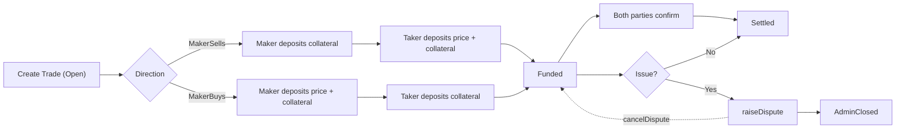
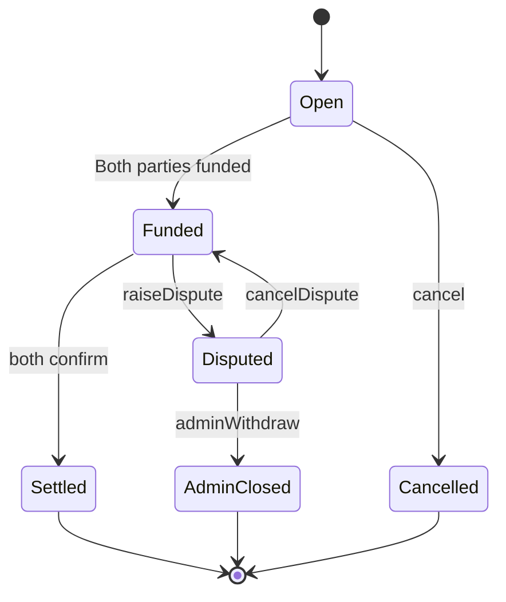

# OtcHub 智能合约

OtcHub 是一个去中心化 OTC 托管平台，通过双向保证金机制保障交易双方安全。

## 功能特性

- **双向交易方向**：支持 MakerSells（卖方发起）与 MakerBuys（买方发起）。
- **双重保证金机制**：买卖双方均需缴纳保证金，提升履约激励。
- **分阶段交易流程**：Open → Funded → Settled/Cancelled/Disputed。
- **争议处理**：支持发起/取消争议与管理员仲裁流程。
- **平台手续费**：可配置的平台手续费（bps）。
- **重入保护**：内置重入攻击防护。
- **签名订单（EIP-712）**：链下签名、链上一键成交，支持部分成交。
- **部分成交**：订单可被多次部分成交直至耗尽。
- **ERC20 Permit（可选）**：在成交时可选用 Permit 降低 Gas 成本。

## 合约结构

### 主要合约

- `contracts/contracts/OtcHub.sol`：核心 OTC 交易合约。
- `contracts/contracts/MockERC20.sol`：用于测试的 ERC20 代币合约。

### 交易状态

- `Open`：已创建，待资金到位。
- `Funded`：双方资金均已到位。
- `Settled`：交易完成并结算。
- `Cancelled`：交易被取消。
- `Disputed`：交易处于争议状态。
- `AdminClosed`：管理员关闭了争议交易。


## 环境安装

```bash
# 进入合约子项目并安装依赖
cd contracts
npm install

# 复制环境变量文件
cp .env.example .env

# 编辑 .env 写入你的配置
```

## 编译

```bash
cd contracts && npm run compile
```

## 运行测试

```bash
# 运行全部测试
cd contracts && npm run test

# 显示 Gas 使用
cd contracts && npm run test:gas

# 覆盖率
cd contracts && npm run test:coverage
```

## 部署

### 本地部署

```bash
# 启动本地 Hardhat 节点
cd contracts && npm run node

# 新终端中部署到本地网络
cd contracts && npm run deploy:local

# 高级部署脚本
cd contracts && npm run deploy:advanced:local
```

### 测试网部署

```bash
# 部署到 Sepolia 测试网
cd contracts && npm run deploy:testnet

# 高级部署脚本
cd contracts && npm run deploy:advanced:testnet
```

### 环境变量

在 `contracts/.env` 中配置：

```env
# Network
SEPOLIA_URL=https://sepolia.infura.io/v3/YOUR_INFURA_PROJECT_ID
PRIVATE_KEY=your_private_key_here

# Etherscan 验证
ETHERSCAN_API_KEY=your_etherscan_api_key_here

# 部署配置
ADMIN_ADDRESS=0x...
VAULT_ADDRESS=0x...
INITIAL_PLATFORM_FEE_BPS=50
```

## 合约验证

```bash
cd contracts && npm run verify:sepolia <CONTRACT_ADDRESS> <CONSTRUCTOR_ARGS>
```

## 使用示例

### 签名订单（EIP-712）

合约支持链下签名订单，买方可在链上一键成交。订单支持部分成交，直到总数量耗尽。

核心结构与函数：

```solidity
struct SellOrder {
    address maker;
    address depositToken;
    uint256 unitPrice;        // 单价
    uint256 unitDeposit;      // 单位保证金
    uint256 totalQuantity;    // 总数量
    uint256 minFillAmount;    // 单笔最小成交量
    uint256 expiry;           // 0 表示不过期
    uint256 nonce;            // 制单者作用域的随机数
    address allowedBuyer;     // 可选指定买家
    TradeDirection direction; // MakerSells | MakerBuys
    bytes32 agreementHash;    // 链下协议哈希
}

function fillSignedOrder(
    SellOrder calldata order,
    uint256 fillAmount,
    bytes calldata signature,
    bytes calldata permitData
) external returns (uint256 tradeId);

function cancelSignedOrder(uint256 nonce) external;

function getRemainingQuantity(
    SellOrder calldata order,
    bytes calldata signature
) external view returns (uint256);
```

Permit 参数（可选）需按如下 ABI 编码：

```solidity
// abi.encode(value, deadline, v, r, s)
```

TypeScript（ethers v6）签名与成交示例：

```ts
import { ethers } from 'ethers'

const domain = {
  name: 'OtcHub',
  version: '1',
  chainId: 11155111, // 例如 Sepolia
  verifyingContract: otcHubAddress,
}

const types = {
  SellOrder: [
    { name: 'maker', type: 'address' },
    { name: 'depositToken', type: 'address' },
    { name: 'unitPrice', type: 'uint256' },
    { name: 'unitDeposit', type: 'uint256' },
    { name: 'totalQuantity', type: 'uint256' },
    { name: 'minFillAmount', type: 'uint256' },
    { name: 'expiry', type: 'uint256' },
    { name: 'nonce', type: 'uint256' },
    { name: 'allowedBuyer', type: 'address' },
    { name: 'direction', type: 'uint8' },
    { name: 'agreementHash', type: 'bytes32' },
  ],
}

const order = {
  maker,
  depositToken,
  unitPrice,
  unitDeposit,
  totalQuantity,
  minFillAmount,
  expiry, // 0 表示不过期
  nonce,
  allowedBuyer: ethers.ZeroAddress,
  direction, // 0: MakerSells, 1: MakerBuys
  agreementHash,
}

// 制单者链下签名
const signature = await makerSigner.signTypedData(domain, types, order)

// 买方链上成交（permitData 可选）
const tx = await otcHub.connect(takerSigner).fillSignedOrder(order, fillAmount, signature, '0x')
const receipt = await tx.wait()
```

签名订单防重放措施：

- EIP-712 域绑定（chainId、合约地址）防止跨链/跨合约重放。
- `orderFilled[orderHash]` 跟踪部分成交；不能超量成交。
- `nonceUsed[maker][nonce]` 在入口校验，且支持 `cancelSignedOrder` 撤销；订单完全成交后会标记该 nonce 已用。
- `expiry` 与 `allowedBuyer` 进一步约束使用范围。

### 创建交易

```solidity
// Taker 创建 MakerSells 交易
uint256 tradeId = otcHub.createTrade(
    makerAddress,            // Maker 地址
    tokenAddress,            // 抵押代币地址
    price,                   // 交易价格
    deposit,                 // 抵押金额
    fundingWindow,           // 注资窗口期
    TradeDirection.MakerSells, // 交易方向
    agreementHash            // 协议哈希
);
```

### 为交易注资

```solidity
// 授权代币转账
token.approve(otcHubAddress, requiredAmount);

// 为交易注资
otcHub.fund(tradeId);
```

### 确认交易

```solidity
// 双方确认交易完成
otcHub.confirm(tradeId);
```

## 交易流程

### MakerSells（卖方发起）

1. Taker 创建交易，指定 Maker 为卖方。
2. Maker 存入抵押金。
3. Taker 存入价格 + 抵押金。
4. 双方完成线下交易。
5. 双方确认交易。
6. 系统自动结算：Maker 收到价格 - 手续费 + 抵押金，Taker 收到抵押金。

### MakerBuys（买方发起）

1. Taker 创建交易，指定 Maker 为买方。
2. Maker 存入价格 + 抵押金。
3. Taker 存入抵押金。
4. 双方完成线下交易。
5. 双方确认交易。
6. 系统自动结算：Taker 收到价格 - 手续费 + 抵押金，Maker 收到抵押金。

### 流程图





## 争议处理

如果交易遇到问题，任一方可以：

1. 发起争议：`raiseDispute(tradeId)`
2. 取消争议：`cancelDispute(tradeId)`（仅限发起争议的一方）
3. 管理员干预：
   - `adminWithdraw(tradeId)`
   - `adminResolveDispute(tradeId, winner, reason)`
   - `adminClearDispute(tradeId, reason)`

## 安全性说明

### 已实现的安全措施

- 重入攻击防护
- 地址与状态校验
- 访问控制
- EIP-712 类型签名与域隔离
- nonce 撤销与部分成交追踪（防重放）

### 风险与建议

1. **缺少暂停机制**：未实现紧急暂停功能。
2. **资金锁定风险**：若争议无人处理，资金可能在争议阶段停留较久。
3. **Permit 兼容性**：`permitData` 采用尽力执行策略；不支持 EIP-2612 的代币将跳过 Permit，需要预先授权。

## 许可证

MIT License
